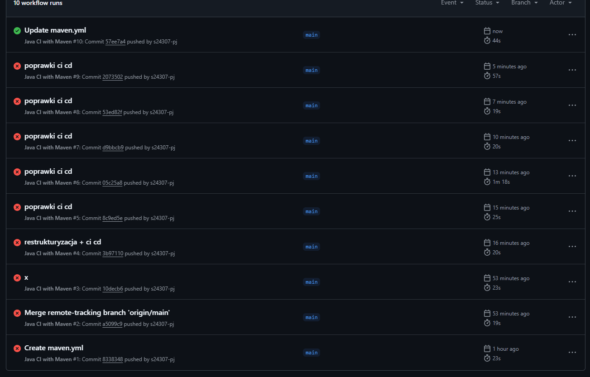

# Zjazd 2

## Scenariusz testowy Trojmiasto.pl
1. Sprawdzam czy strona zawiera tytuł
2. Sprawdzam czy strona zawiera zakładkę polecamy
3. Sprawdzam czy istnieje strona raport
4. Sprawdzam czy na stronie jest przycisk do zalogowania się
5. Sprawdzam czy link sport przekierowuje na dobrą stronę
6. Sprawdzam czy strona zawiera logo
7. Sprawdzam czy wyszukiwarka na stronie działa
8. Sprawdzam czy strona zawiera newsy
## Scenariusz testowy Droptica
1. Sprawdzam czy istnieje tytuł strony
2. Sprawdzam czy strona ma menu
3. Sprawdzam czy strona posiada przycisk do kontaktu
4. Sprawdzam czy strona ma logo
5. Sprawdzam czy strona ma linki w footerze
6. Sprawdzam czy strona ma artykuły
7. Sprawdzam czy strona ma formularz kontaktowy
8. Sprawdzam czy nowemu użytkownikowi wyświetla się popup
## Sceneriusz testowy Wikipedia
1. Sprawdzam czy jest h1
2. Sprawdzam czy jest główna treść
3. Sprawdzam czy jest infobox
4. Sprawdzam czy są linki do zewnętrznych stron
5. Sprawdzam sekcje z kategoriami
6. Sprawdzam sekcje przypisy
7. Sprawdzam czy są obrazki na stronie
8. Sprawdzam czy są linki w footerze
## Scenariusz testowy Otomoto
1. Sprawdzam czy istnieje treść na podstronie części
2. Sprawdam czy istnieje sekcja z ofertami
3. Sprawdzam czy istnieje zaawansowane wyszukiwanie
4. Sprawdzam czy istnieje footer z polityka prywatnosci
5. Sprawdzam czy istnieje baner
6. Sprawdzam czy istnieje przycisk do logowania
7. Sprawdzam czy istnieje formularz
8. Sprawdzam czy strona ma tytuł

# Zjazd 3
